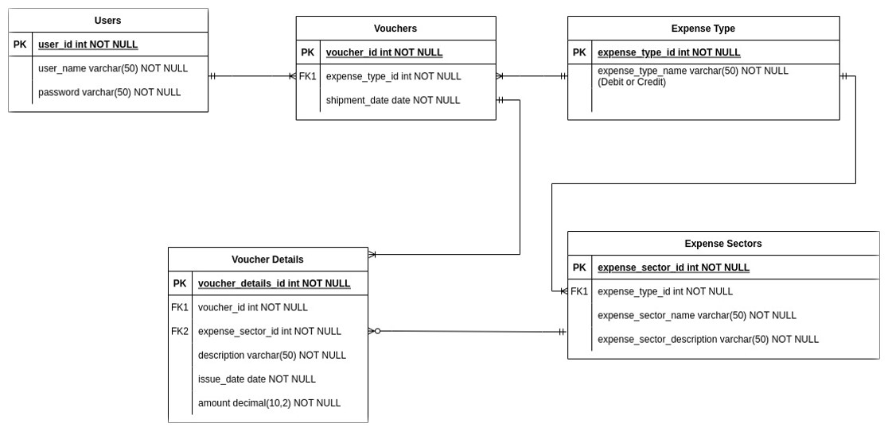

# Voucher Management System

## Motivation

Every company needs to maintain a voucher management system for their daily expenses. We are trying to solve this problem using our project.

## Prospective Client

Any company who has quite a good number of expenses to maintain in their daily routine, will be helped by this software.

## Searching Options

We can search based on many conditions. Some of them are as follows:

 
1. The vouchers by the issuer user 
2. Total expense of a month by querying all the vouchers 
3. Total earning of a month by querying all the credit vouchers
4. View voucher details through searching by Voucher Id

## Project Structure:

### TABLES:

1. Users

   - User_ID
   - User_name
   - Password
   - email

2. Vouchers

   - Voucher_ID
   - Expense_type_id
   - User_ID

3. Expense Type

   - Expense_type_name
   - Expense_type_id

4. Voucher Details
   - voucher_id
   - Expense_sector_id
   - issue_Date
   - Description
   - Voucher_ID
   - Amount

## Schema Diagram

 

## ER Diagram

 
 
 

## User Interfaces

<h3 style="text-align:center"> Welcome Screen </h3>

 
 
 
<h3 style="text-align:center"> Log IN </h3>

 
 
 
<h3 style="text-align:center"> Create Voucher </h3>

 
 
 
<h3 style="text-align:center"> Voucher Hub </h3>

 
 
 
<h3 style="text-align:center"> Search By Voucher ID </h3>

 
 
 
<h3 style="text-align:center"> Summary </h3>

## Tools

